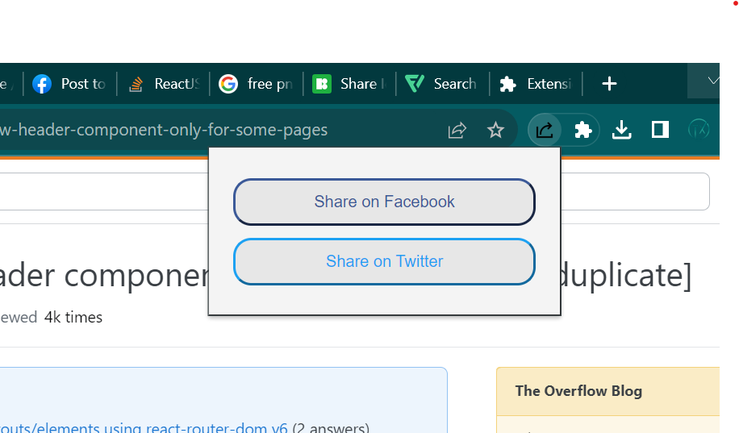

# Share Link Chrome Extension

Share Link is a Chrome extension that allows users to share a webpage's URL and its summary directly to Facebook and Twitter with the click of a button. Perfect for content curators and social media enthusiasts!

## Features

- 🚀 **One-Click Sharing**: Directly post to Facebook & Twitter.
- 📑 **Summary Extraction**: Auto-fetches the page's meta description as a summary.
- 🎨 **Classic Design**: Intuitive and clean interface.

## Preview



## Installation & Setup

1. **Clone the Repository**:
```bash
git clone https://github.com/iamumarjaved/Sharepost.git
```

2. **Load the Extension into Chrome**:
   -Navigate to **chrome://extensions/** in Chrome.
   -Turn on **'Developer Mode'** (toggle switch in the top right corner).
   -Click on Load unpacked.

Navigate to the directory where you cloned the repository and select it.

## How to Use:
   -Visit any webpage you'd like to share.
   -Click the Share Link extension icon.
   -Select your desired platform (Facebook or Twitter).
   
**The extension will fetch the page's summary and open a sharing window for the chosen platform.**
